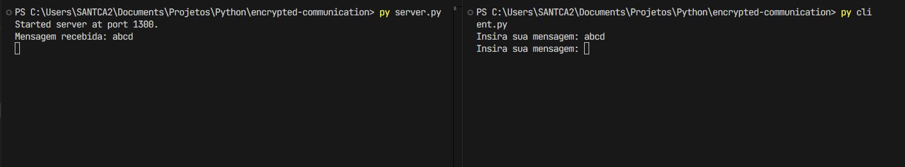
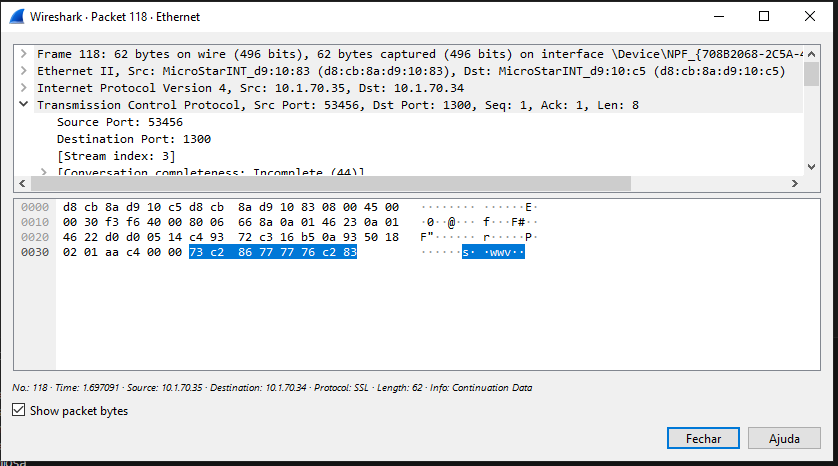

# Encrypted Communication

Esse projeto foi desenvolvido como um trabalho para a disciplina de Tópicos Avançados de Rede na Faculdade Engenheiro Salvador Arena.

O objetivo é estabelecer uma conexão entre um cliente e um servidor TCP, realizando a comunicação através da troca de mensagens encriptadas. Como algoritmo para encriptação, será utilizada a cifra de César, cuja chave será determinada a partir da troca de chaves de Diffie-Hellman.

## Time

- Carlos Santos (081200016)
- Caio Rodrigues (081200011)
- Nathan Vilela (081200028)
- Guilherme Turtera (081200007)

## Estrutura do repositório

Abaixo, segue a estrutura do repositório e a descrição de cada componente do código.

```
├── src                   # pasta principal do projeto
    ├── caesar_cypher.py  # cifra de César
    ├── client.py         # funcionamento do cliente
    ├── connection.py     # envio e recebimento de mensagens
    ├── diffie_hellman.py # troca segura de chaves secretas
    ├── prime.py          # geração de números primos
    └── server.py         # funcionamento do servidor TCP
├── client.py             # ponto de entrada para executar o cliente
└── server.py             # ponto de entrada para executar o servidor
```

**src**: pacote de código fonte, contém toda a lógica fundamental do projeto.
- **caesar_cypher.py**: contém o algoritmo da cifra de César com base em uma mensagem e um fator de deslocamento passados como argumentos.
- **client.py**: contém a lógica de loop do cliente TCP.
- **connection.py**: contém uma função de envio e uma de recebimento de mensagens, ambas utilizadas pelos módulos ``client.py`` e ``server.py`` para comunicação.
- **diffie_hellman.py**: contém funções para determinação de parâmetros *P* e *G* do algoritmo de Diffie-Hellman, bem como os algoritmos para determinar a chave privada, a chave pública e o valor secreto a ser computado durante a troca.
- **prime.py**: contém funções para determinar se um número é ou não é primo e gerar novos números primos.
- **server.py**: contém a lógica do loop do servidor TCP.

**client.py**: arquivo externo utilizado para facilitar o uso da aplicação. Serve para executar o loop do cliente definido em ``src/client.py``.

**server.py**: arquivo externo utilizado para facilitar o uso da aplicação. Serve para executar o loop do servidor TCP definido em ``src/server.py``.

## Funcionamento

O passo a passo a seguir demonstra como executar a aplicação.

1. Instale um interpretador Python (3.9+).
2. [Opcional] Especifique o endereço e a porta do servidor nos arquivos ``client.py`` e ``server.py``, conforme demonstrado abaixo. Se nenhum endereço ou porta for especificado, os valores padrão serão ``localhost`` e ``1300``.

```client.py
from src.client import start_client

start_client("HOST", "PORTA")
```

```server.py
from src.server import start_server

start_server("HOST", "PORTA")
```

3. Em um terminal, inicie o servidor utilizando o comando ``python server.py``.
4. Em outro terminal, inicie o cliente utilizando o comando `` python client.py``.
5. Insira uma mensagem no cliente e dê envie. O resultado deve ser semelhante ao observado abaixo.



## Segurança

Antes de iniciar a comunicação, o servidor e o cliente realizam a troca de chaves Diffie-Hellman, enviando parâmetros públicos que, ao se misturarem com chaves privadas internas de cada dispositivo, geram um valor secreto. Esse valor secreto é utilizado como chave para realizar a cifra de César, um algoritmo de encriptação baseado no deslocamento de caracteres em uma mensagem.

Ao enviar a mensagem, o cliente utiliza a chave determinada para encriptá-la, de modo que um *man-in-the-middle* não seja capaz de interceptá-la na sua forma original, conforme observado abaixo pelo *software* Wireshark.


